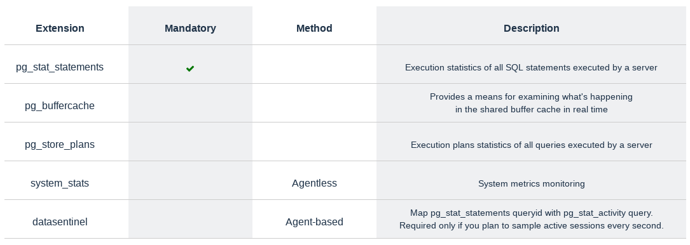

Extensions
============

.. toctree::
   :maxdepth: 1

   pg-stat-statements
   ../features/execution-plans
   system-stats
   ../features/installation

.. note::
   | The installation of the **pg_stat_statements** extension is mandatory

.. warning::
   | Extensions need to be installed in the **postgres** database of your instances

