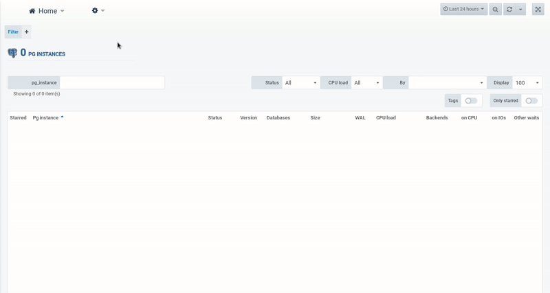

.. _agentless_feature:

***********
Agentless
***********

.. warning::
   | The Agentless feature is not available if you use our SAAS platform

.. note::
   | For an on-premises installation, you can use either the agent-based or agentless feature. (See :ref:`agentless`)
   | You can have a hybrid architecture that uses both methods

The agentless feature lets you monitor PostgreSQL managed systems of cloud providers (private or public)

- AWS RDS, Aurora 
- Microsoft Azure database, hyperscale
- Google Cloud SQL 
- Other public cloud providers

Connections can be created either with the :ref:`connection_management_agentless`
or with the :ref:`connection_api`

.. _connection_management_agentless:

User interface connection management
************************************

