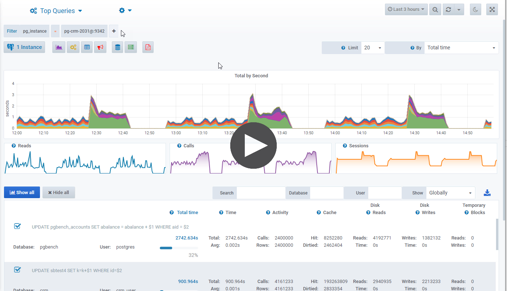

.. _top-queries:

***********
Top Queries
***********

.. note::

    | Top queries are collected thanks to the :ref:`pg_stat_statements` extension
    |
    | Execution plans are collected thanks to the :ref:`pg_store_plans <pg_store_plans>` extension

- Limit the result to the top N queries
- Finely analyze your top queries among the following dimension:
    * Total time
    * Calls
    * Rows
    * Shared blocks hit
    * Shared blocks read 
    * Shared blocks dirtied 
    * Shared blocks written
    * Temporary blocks read
    * Temporary blocks written
    * Read time
    * Write time
    * Local blocks hit
    * Local blocks read 
    * Local blocks dirtied 
    * Local blocks written
    * WAL size (since Postgres 13)

- Display the run-time statistics:
    * Globally
    * By call
    * By second

- Drill-down into a selected query to view its historical statistics as well as its execution plans.

.. raw:: html 

    <h4>The dedicated dashboard displays the information in a multi-dimensional way with Time selection, Time zooming and Tag filtering</h4>

