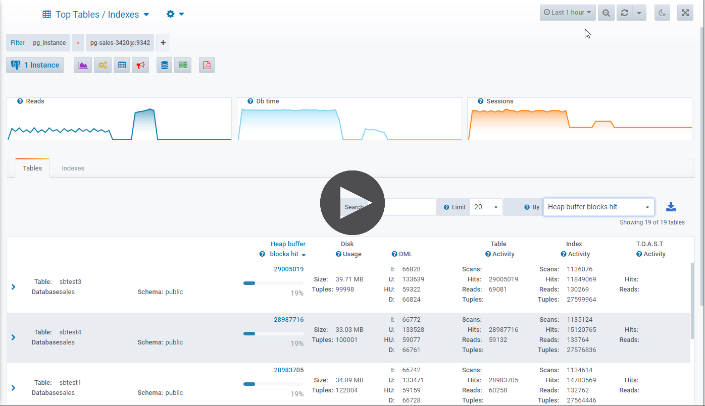

.. _top-tables:

*********************
Top Tables / Indexes
*********************

This feature allows you to identify the most accessed relations according to a chosen dimension.

.. note::

    | Relation statistics are collected once a hour.
    |
    | By default, datasentinel disable the collection if the PostgreSQL instance has more than **1000** tables.
    | You can enable / disable the collection by setting the limit number at the agent level with the agent :ref:`agent-cli` or with agent :ref:`agent-apis`.

Top Tables
==========

- Finely analyze your tables among the following dimension
    * Tuples
    * Size
    * Sequential scans
    * Index scans
    * Seq. scans rows fetched 
    * Index scans rows fetched 
    * Heap buffer blocks hit
    * Heap disk blocks read
    * Index disk blocks read
    * Index buffer blocks hit
    * Inserts
    * HOT updates
    * Updates 
    * Deletes 
    * Dead tuples
    * Live tuples
    * Tuples modified since analyze
    * Frozen xid
    * Age frozen xid
    * TOAST buffer blocks hit
    * TOAST disk blocks read
    * TOAST buffer index blocks hit
    * TOAST disk index blocks read
 

- Drill-down into a selected table to view its historical statistics as well as its index statistics.

Top Indexes
==========

- Finely analyze your indexes among the following dimension
    * Index scans
    * Index buffer blocks hit
    * Index disk blocks read
    * Index scans rows fetched
    * Index scans rows read
    * Size

- Drill-down into a selected index to view its historical statistics.
  

.. raw:: html 

    <h4>Both dashboards (Tables and Indexes) display the information in a multi-dimensional way with Time selection, Time zooming and Tag filtering</h4>

