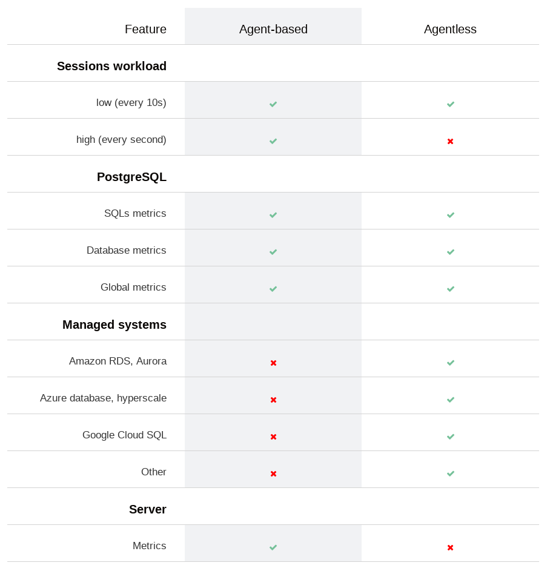
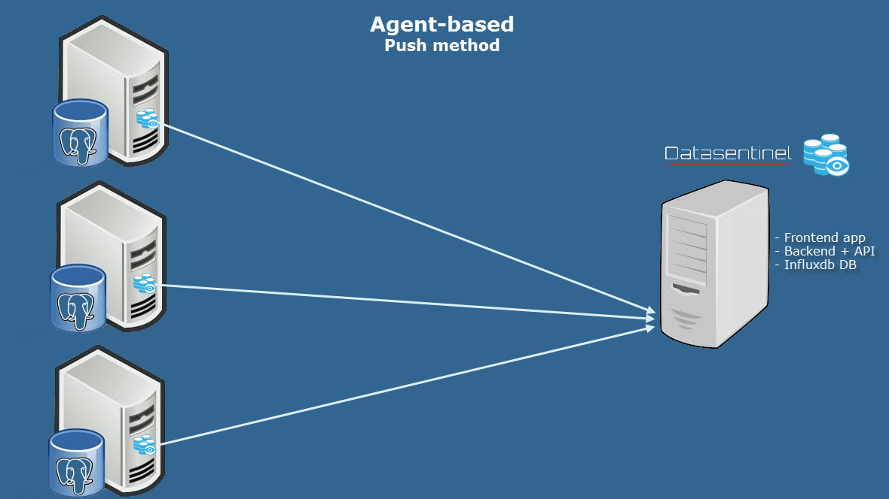
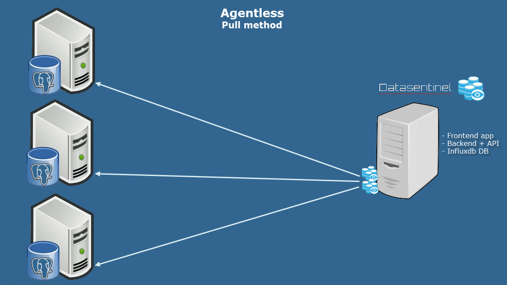

.. _agentless:

*************************
Agent-based or Agentless?
*************************

.. note::
   | If you use SAAS Datasentinel, you need to install agents locally on your servers (See :ref:`agent-installation`)

.. raw:: html

   <h3>For an on-premises installation, you can use either the agent-based or the agentless feature </h3>

.. note::
   | You can have a hybrid architecture that uses both methods

.. raw:: html

   <h3>The table below compares the differences between the 2 methods</h3>

.. note::
   | The agent-based feature needs agents to be installed locally on each server (See :ref:`agent-installation`). 
   | Agents send data (PUSH method) and use https to communicate with the platform

.. note::
   | In the agentless architecture, the platform collects data (PULL method)

