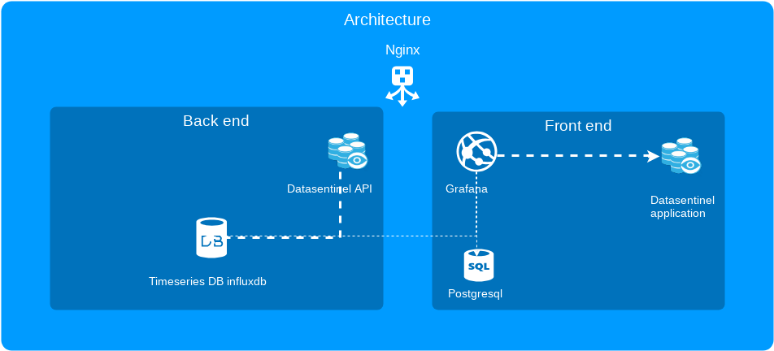

.. _on_prem_installation:

**********************************
On-premises platform installation
**********************************

.. raw:: html

   <h4>See our Blog entry <a href="https://www.datasentinel.io/blog/post/start/" target="_hblank">Getting started with Datasentinel on-premises</a>  </h4>

   <h3>Prerequisites</h3>

You need to have a linux machine **Red Hat or centos 7**:
    - Nginx web server preinstalled
    - >= 4 CPUS 
    - >= 16 GB RAM
    - >= 50 GB STORAGE
    - See :ref:`sizing recommendations in our FAQ<sizing_platform>`

.. note::
   | The platform is composed of several components packaged in a single file **install-datasentinel-platform-latest.tar.gz** (size 550 MB)

1. License
***********

A license key is required to use Datasentinel.

Obtain a Datasentinel license key:

- Users who want to try Datasentinel with a 30-day trial can obtain a license key on the `Trial page <https://www.datasentinel.io/#/freetrial>`_

- Existing customers can obtain their license key from Datasentinel Support: support@datasentinel.io

See How to update the :ref:`token` to enable the license key.

1. Download
***********

Download the installation file at https://app.datasentinel.io/ds-api/download/install-datasentinel-platform-latest.tar.gz

.. code-block:: bash

   wget https://app.datasentinel.io/ds-api/download/install-datasentinel-platform-latest.tar.gz

3. Uncompress
*************

.. code-block:: bash

   tar xvzf install-datasentinel-platform-latest.tar.gz

3 files are created

- init_datasentinel.sh
- datasentinel-platform.tar.gz
- nginx-1.18.0-1.el7.ngx.x86_64.rpm

.. note::
   | If not installed, you can install nginx with the included rpm file -> **yum localinstall nginx-1.18.0-1.el7.ngx.x86_64.rpm**

4. Install
**********

| Run the shell script

.. code-block:: bash

   ./init_datasentinel.sh

.. warning:: 
   The script must be run as root

.. warning::
   | The binaries of the application as well as the database storing the metrics will be installed in the **/datasentinel** directory
   | You can pre-create **/datasentinel**. It can be a symbolic link or a file-system or a directory
   | Otherwise, the **/datasentinel** directory will be created during installation
   | This directory should be empty.

.. raw:: html

   <h3>The script does several actions</h3>

- Application user name input request (**datasentinel** by default, the user can be pre-created with **bash** as the default shell)
- Application listening port entry request (**443** by default)
- Creation if not exists of the directory **/datasentinel**
- **datasentinel-platform.tar.gz** decompression to install all components
- **bash_profile** and **crontab** entries creation
- Services deployment for automatic restart
- Start of all components

.. note:: 
   | If you want to install datasentinel silently, use **./init_datasentinel.sh -d**
   | Default values will be used

.. caution::
   | nginx uses a self-signed certificate located in **/etc/nginx/certs** directory
   | You can change it with your own certificate.

.. caution::
   | The listening port must be opened and accessible.
   | Also, be careful with your firewall configuration (selinux, firewalld) if any

.. note:: 
   | At the end of the script, the datasentinel repository should be UP and RUNNING.
   | 
   | You should be able to connect to the user interface.
   | Open a brower and type **https://<<your-hostname>>**
   | The login is **datasentinel**
   | The password is given by datasentinel team

5. Components
*************

Datasentinel uses the following components:

- Nginx web server
- Datasentinel backend APIs
- Datasentinel dispatcher (Agentless feature)
- Timeseries database influxdb
- Grafana Frontend (with a postgreSQL database)
- Datasentinel Frontend application

.. note:: 
   | Each component is restarted automatically with a system service 
   | located on **/usr/lib/systemd/system**

6. Components management
************************

Start

.. code-block:: bash

    systemctl start datasentinel_influxdb datasentinel_postgresql datasentinel_grafana datasentinel_backend datasentinel_dispatcher nginx

Stop

.. code-block:: bash

    systemctl stop datasentinel_influxdb datasentinel_postgresql datasentinel_grafana datasentinel_backend datasentinel_dispatcher nginx

Status details

.. code-block:: bash

    systemctl -l | egrep -i "datasentinel_|nginx"

.. raw:: html

   <h3>An alias is present when connected as datasentinel to check all components availibility</h3>

.. code-block:: bash

   status_datasentinel

Output

.. code-block:: bash

   datasentinel_backend.service                                       loaded active running   Datasentinel backend APIs
   datasentinel_dispatcher.service                                    loaded active running   Datasentinel dispatcher
   datasentinel_influxdb.service                                      loaded active running   InfluxDB service
   datasentinel_grafana.service                                       loaded active running   Grafana daemon
   datasentinel_postgresql.service                                    loaded active running   PostgreSQL 10 database server
   nginx.service                                                      loaded active running   The nginx HTTP and reverse proxy server

7. Useful log files
********************

.. note:: 
   | Log files are located in the directory **/datasentinel/log** except the nginx log file

+---------------------------------------+--------------------------------------------------------------------------------------------------+
| Log file                              | Information                                                                                      |
+=======================================+==================================================================================================+
| /var/log/https_datasentinel.log       | Nginx log access                                                                                 |
+---------------------------------------+--------------------------------------------------------------------------------------------------+
| backend_apis.log                      | API calls                                                                                        |
+---------------------------------------+--------------------------------------------------------------------------------------------------+
| backend_to_influx.log                 | Log data copied to influxdb database                                                             |
+---------------------------------------+--------------------------------------------------------------------------------------------------+
| dispatcher.log                        | Agentless feature log file                                                                       |
+---------------------------------------+--------------------------------------------------------------------------------------------------+
| compute.log                           | Internal metrics compute done by datasentinel                                                    |
+---------------------------------------+--------------------------------------------------------------------------------------------------+
| grafana.log                           | Grafana log access                                                                               |
+---------------------------------------+--------------------------------------------------------------------------------------------------+

