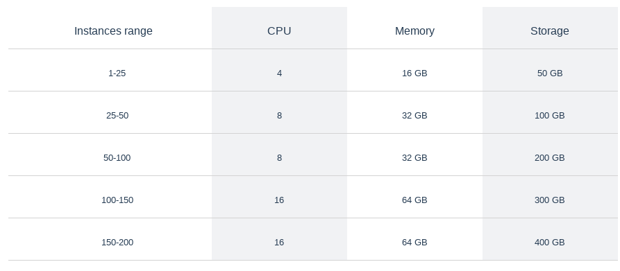

.. _aws:

****************
AWS marketplace
****************

1. How to connect?
******************

| Once you get your Datasentinel server running, you can log to it via the web browser.
|
| The user is **datasentinel**
| The default password is **datasentinel** (to be changed once connected)
|
| Datasentinel is a subscription application and will start charging you after you start monitoring instances.

2. How to configure instances?
******************************

Datasentinel comes with 2 methods :

    You can use either the Agent-based or the Agentless feature to monitor your instances. (See :ref:`agentless`)

3. Can i monitor rds or aurora instances for PostgreSQL?
***********************************************************

Yes, use the Agentless feature to configure and monitor your managed instances.

4. Can I use it to monitor my on premises instances from the cloud or vice versa?
*********************************************************************************
Yes, you can monitor both cloud and on premises instances as long as you have connectivity to the instance you want to monitor.

1. How to configure SSL?
************************

| Datasentinel uses a self signed certificate configured with NGINX
| 
| The self-signed certificate is located in **/etc/nginx/certs** directory
| You can change it with your own certificate.

1. Generate a certificate for the platform machine

2. Replace existing files with the real certificate (cert_datasentinel.pem and key_datasentinel.pem)

3. Restart NGINX

2. AWS EC2 sizing
*****************

1. CPU AND MEMORY

    **t2.medium** is the Minimum Required Instance Type

    This instance size allows monitoring up to 10 instances.

2. STORAGE

    The needed storage will depend on several factors

    The number of PostgreSQL instances to monitor

    The data retention period (default 14 days)

    The number of tags associated to each instance.

    The number of distinct queries (pg_stat_statements)

    An average value has been observed of 150 MB per day per instance

    For example

        You have 50 PostgreSQL instances

        The default data retention is used : 14 days

        You have 5 custom tags per instance

        With this configuration, the needed space to store data is 50 * 150 * 14 = **100 GB**

The values displayed below are default values for standard workloads and default data retention

